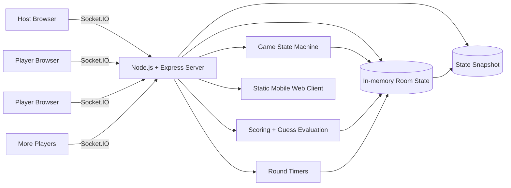
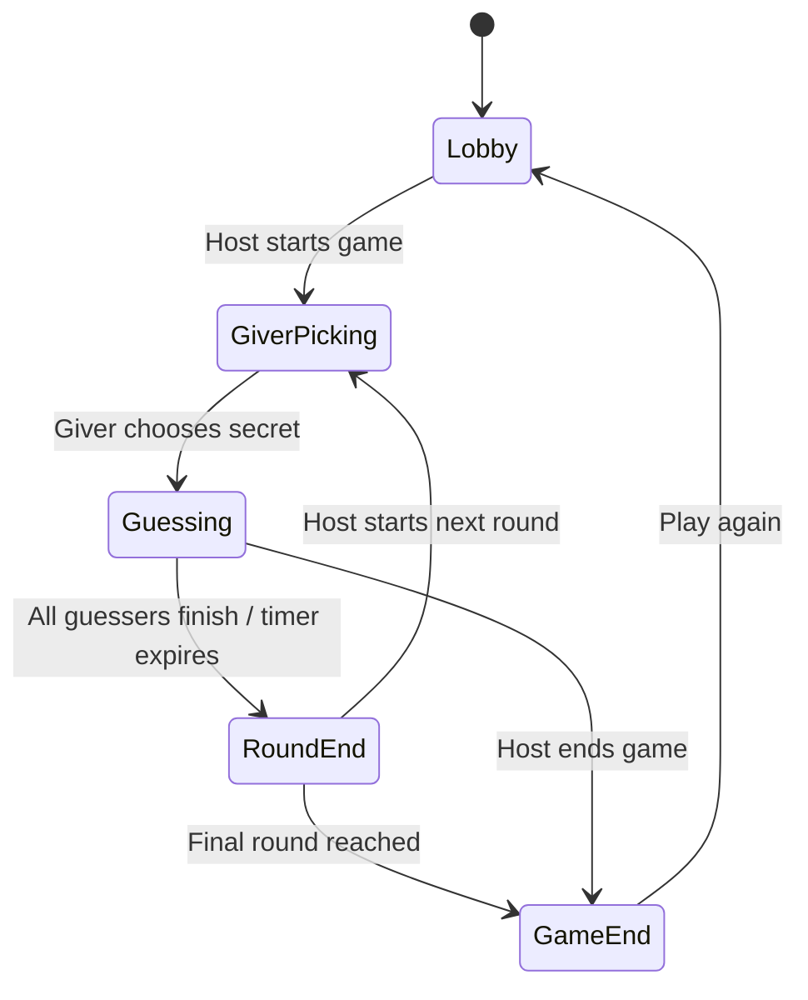

# BlckWhte — Black & White

**A real-time multiplayer word-guessing party game built for phones and laptops.**

> **Portfolio project** · Source code is maintained in a private repository.

[**GitHub Showcase →**](https://github.com/adityajain28/BlckWhte-Showcase)

One player creates a game and receives a six-digit room code. Everyone else joins from a browser. The server coordinates the lobby, rotating giver/guesser roles, guesses, scoring, timers, reconnects, and round progression in real time.

The game can run over the internet or entirely on a local Wi-Fi network, making it usable even when internet access is unavailable.

---

## How the game works

Each round has one **Giver** and multiple **Guessers**.

The Giver chooses a four-letter secret word with unique letters. Guessers then have up to ten attempts to find it.

After each attempt:

- **White** — correct letter in the correct position
- **Black** — correct letter in the wrong position
- **Grey** — letter is not in the word

Points reward solving the word efficiently:

```text
score = 10 - attempts
```

The giver rotates between players as the game progresses.

---

## Key features

- **Real-time multiplayer** using Socket.IO
- **Six-digit room codes** for joining sessions
- **Mobile-first browser experience**
- **Server-authoritative game state**
- **Rotating giver and guesser roles**
- **Round timers and configurable round limits**
- **Live standings and cumulative scoring**
- **Reconnect support**
- **State restoration after server restarts**
- **24-hour room lifecycle**
- **Local Wi-Fi / hotspot play without internet**
- **Online deployment support**

---

## Architecture



---

## Game-state model

The server controls the game through explicit phases:



Keeping the server authoritative prevents different clients from drifting into inconsistent versions of the game.

---

## Engineering highlights

### 1. Real-time room coordination

Each room has its own players, host, round state, scores, timers, and lifecycle. Socket.IO rooms are used to broadcast only to the participants in a specific game.

### 2. Server-authoritative guess evaluation

The secret word and evaluation logic live on the server. Clients submit guesses and receive only the information needed to render the result, keeping game state consistent across participants.

### 3. Reconnect and recovery

A player can reconnect using the same room code and name. The server restores the player's current context, including room phase, current giver, previous guesses, completion state, cumulative ranking, and active timer information.

### 4. Persistent session snapshots

Game state is periodically saved to disk and restored when the server starts again. If an active timer was running, the recovery logic determines whether the timer is still valid or whether the round should already have ended. Rooms expire after 24 hours of inactivity.

### 5. Works without internet

Because the Node.js server can bind to the host machine's local network address, players on the same Wi-Fi or phone hotspot can join directly. That makes the game usable in environments where everyone has a local network but not necessarily an internet connection.

---

## Tech stack

| Area | Technology |
|---|---|
| Server | Node.js |
| HTTP | Express |
| Real-time transport | Socket.IO / WebSockets |
| Client | HTML, CSS, JavaScript |
| Game state | In-memory room model |
| Recovery | JSON state snapshots |
| Deployment | Node-compatible web hosting |
| Local multiplayer | LAN / Wi-Fi / mobile hotspot |

---

## Interesting implementation problems

### Room lifecycle
A room needs to survive multiple rounds while keeping the same join code. It also needs to expire eventually so abandoned sessions do not stay in memory indefinitely.

### Player identity after reconnect
Socket IDs change when a browser reconnects. The game therefore separates the player's persistent identity inside a room from their current socket connection.

### Timer recovery
A timer cannot simply restart from zero after a server restart. The state stores an absolute round end time, allowing the server to calculate the remaining duration after recovery.

### Multiplayer consistency
Round transitions are controlled by the server rather than individual clients. This keeps the host, giver, and guessers synchronized as the game moves between phases.

---

## What I focused on

This project was primarily an exercise in building a complete multiplayer experience rather than a static front-end demo.

The parts I focused on most were:

- designing a simple real-time protocol between browser clients and the server
- modeling a multiplayer game as explicit server-side phases
- managing room and player state
- handling disconnects and reconnects cleanly
- restoring sessions after server restarts
- making the experience usable from phones with almost no setup
- supporting both internet-hosted and local-network play

---

## Future improvements

- durable database-backed room persistence for cloud deployments
- authenticated player profiles
- spectator mode
- automated integration tests for multi-client game flows
- custom word lengths and game modes
- game analytics and match history
- QR-code joining for faster mobile setup

---

## Source code

The application source code is kept in a **private repository**.

This public repository is intentionally limited to product documentation, architecture, and engineering context.

**Source access can be provided during an interview or technical review when appropriate.**
